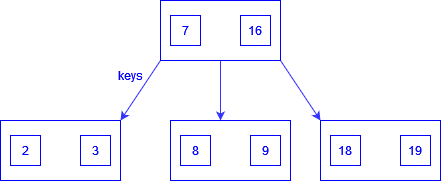

### B-Tree

  
  

  B-Tree
  

B-Tree is an implementation of self-balancing binary trees.

 A `B-Tree` of Order `M`:
- Every node has at most `m` children
- A non-leaf node with `k` children contains `k-1` keys.
- The root has at least two children if it is not a leaf node
- Every non-leaf node (except root) has at least `m/2` children
- All leaves appear in the same level
> - There are lower and upper bounds on the number of keys a node can contain.
These bounds can be expressed in terms of a fixed integer `t >= 2` called the *minimum degree of the `B-Tree`*
	- Every node other than the root must have atleast `t-1` keys. If the tree is nonempty, the root must have
	atleast one key
	- Every node can contain at most `2t-1` keys. Therefore, an internal node can have at most `2t` children. We say that
	a node is *full* if it contains exactly `2t-1` keys.

> `B-Tree` has `O(log(n))` time for search, insert and delete operations

### Insertion of Node

### References

- [B-Tree Tutorial- An introduction to binary tree](https://www.youtube.com/watch?v=C_q5ccN84C8&t=480s)
- [6.046 Spring 2015, Design and Analysis of Algorithm: Recitation 2 B-Tree](https://www.youtube.com/watch?v=TOb1tuEZ2X4)
- [B-Tree by Geekifi](https://www.youtube.com/watch?v=SI6E4Ma2ddg)
- [B-Tree lecture 16 by utexas.edu](https://www.cs.utexas.edu/users/djimenez/utsa/cs3343/lecture16.html)
- [B-Tree lecture 17 by utexas.edu](https://www.cs.utexas.edu/users/djimenez/utsa/cs3343/lecture17.html)