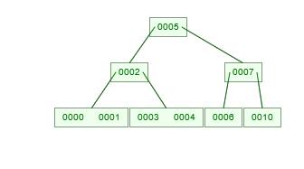

### B-Tree

  
  

  B-Tree
  

B-Tree is an implementation of self-balancing binary trees.

A `B-Tree` of Order `M`:
- Every node has at most `m` children
- A non-leaft node with `k` children contains `k-1` keys.
- The root has at least two children if it is not a leaf node
- Every non-leaf node (except root) has at least `m/2` children
- All leaves appear in the same level

> `B-Tree` has `O(log(n))` time for search, insert and delete operations

### Insertion of Node

### References

- [B-Tree Tutorial- An introduction to binary tree](https://www.youtube.com/watch?v=C_q5ccN84C8&t=480s)
- [6.046 Spring 2015, Design and Analysis of Algorithm: Recitation 2 B-Tree](https://www.youtube.com/watch?v=TOb1tuEZ2X4)